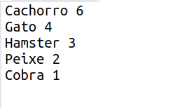
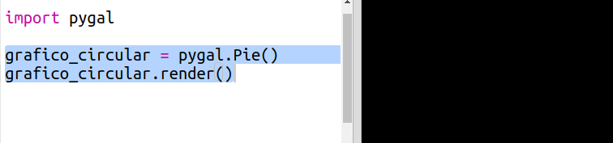
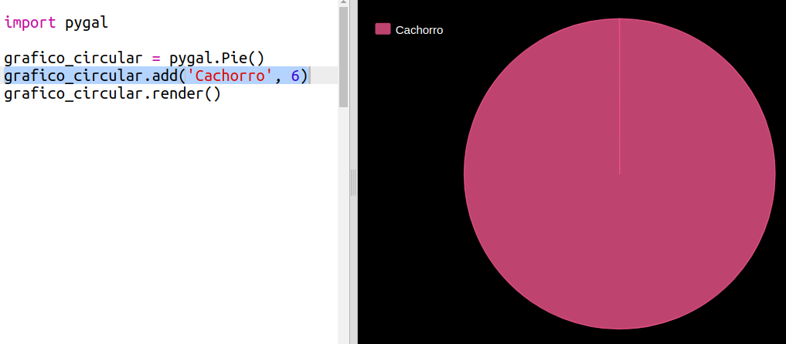
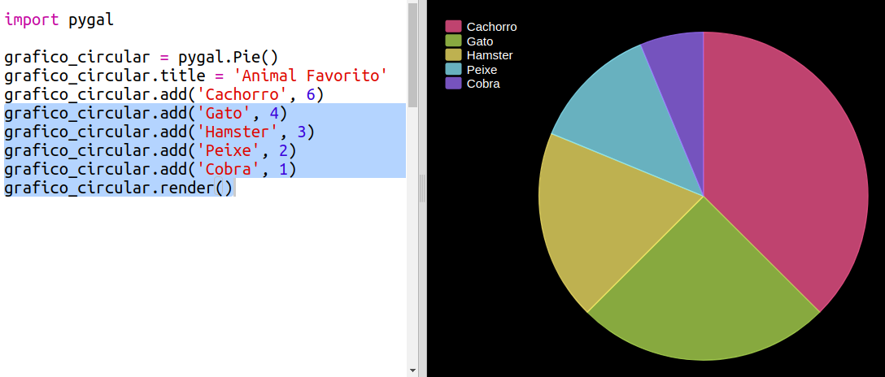
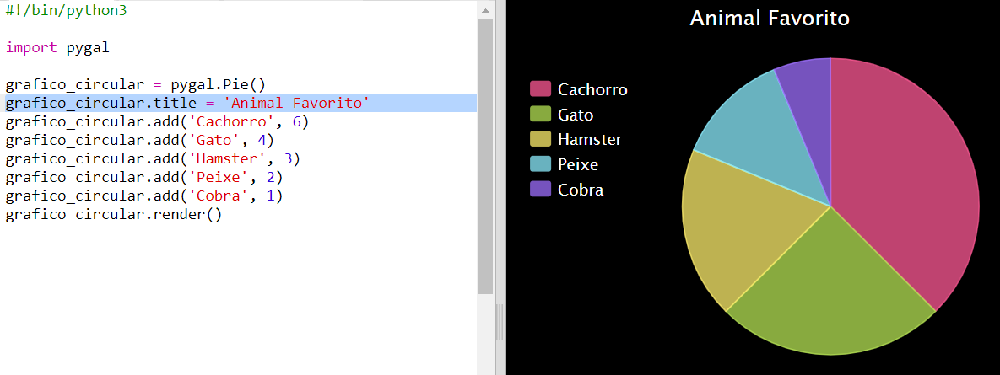

## Crie um gráfico de pizza

Gráficos de pizza são uma forma útil de mostrar dados. Vamos fazer uma pesquisa dos animais favoritos no seu Code Club e, em seguida, apresentar os dados como um gráfico de pizza.

+ Peça ao líder do seu clube para ajudar a organizar uma pesquisa. Você pode gravar os resultados em um computador conectado a um projetor ou em um quadro branco que todos possam ver.
    
    Escreva uma lista de animais de estimação e certifique-se de que os favoritos de todos estejam incluídos.
    
    Depois, faça com que todos votem em seu favorito, levantando a mão quando o animal for nomeado. Só um voto por pessoa!
    
    Por exemplo:
    
    

+ Abra o modelo Trinket em branco do Python: <a href="http://jumpto.cc/python-new" target="_blank">jumpto.cc/python-new</a>.

+ Vamos criar um gráfico de pizza para mostrar os resultados da sua pesquisa. Você estará usando a biblioteca PyGal para fazer um pouco do trabalho pesado.
    
    Primeiro importe a biblioteca Pygal:
    
    

+ Agora vamos criar um gráfico de pizza e renderizar (exibir):
    
    
    
    Não se preocupe, fica mais interessante quando você adiciona dados!

+ Vamos adicionar os dados de um dos animais de estimação. Use os dados que você coletou.
    
    
    
    Há apenas um dado, então ele ocupa todo o gráfico de pizza.

+ Agora adicione o restante dos dados da mesma maneira.
    
    Por exemplo:
    
    

+ E para finalizar seu gráfico, adicione um título:
    
    