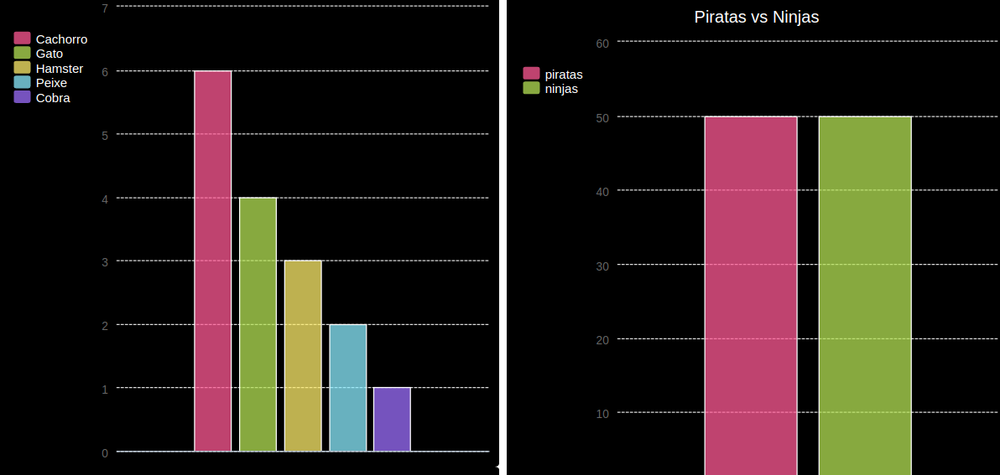

\--- challenge \---

## Desafio: crie seu próprio gráfico de barras

Você pode criar gráficos de barras de maneira semelhante. Apenas use, `grafico_barra = pygal.Bar()` para criar um novo gráfico de barras, e então adicione os dados e renderize do mesmo jeito que para um gráfico de pizza.

Colete dados de seus membros do Code Club para criar seu próprio gráfico de barras.

Certifique-se de escolher um tópico que todos saibam!

Aqui estão algumas idéias:

+ Qual é o seu esporte favorito?
+ Qual é o seu sabor favorito de sorvete?
+ Como você chega na escola?
+ Qual é o mês do seu aniversário?
+ Você joga Minecraft? (sim/não)

Não faça perguntas que forneçam dados pessoais, como o endereço das pessoas. Pergunte ao líder do seu clube se não tiver certeza.

Exemplos:

\--- /challenge \---