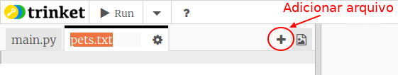
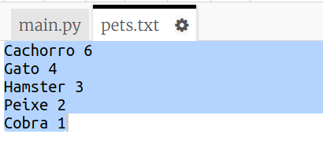
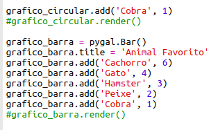
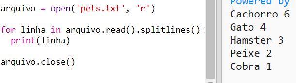
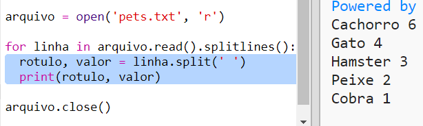
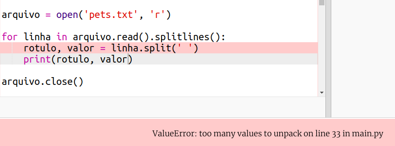
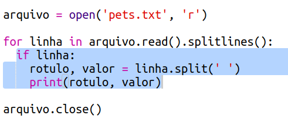
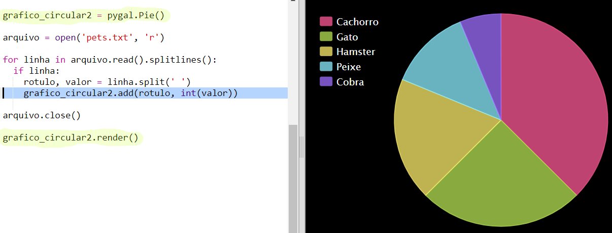

## Ler dados de um arquivo

É útil poder armazenar dados em um arquivo em vez de ter que incluí-los em seu código.

+ Adicione um novo arquivo ao seu projeto e chame-o de `pets.txt`:
    
    

+ Agora adicione dados ao arquivo. Você pode usar os dados favoritos de animais de estimação que você coletou ou os dados de exemplo.
    
    

+ Volte para `main.py` e comente as linhas que renderizam (exibem) gráficos e gráficos (para que não sejam exibidos):
    
    

+ Agora vamos ler os dados do arquivo.
    
    
    
    O laço `for` fará um loop nas linhas do arquivo. `splitlines ()` remove o caractere de nova linha do final da linha, já que você não quer isso.

+ Cada linha precisa ser separada em um rótulo e um valor:
    
    
    
    Isso dividirá a linha nos espaços, portanto, não inclua espaços nos rótulos. (Você pode adicionar suporte para espaços em rótulos depois.)

+ Você pode receber um erro como este:
    
    
    
    Isso acontece se você tiver uma linha vazia no final do seu arquivo.
    
    Você pode corrigir o erro obtendo o rótulo e o valor apenas se a linha não estiver vazia.
    
    Para fazer isso, indente o código dentro do seu loop `for` e adicione o código `if linha:` acima:
    
    

+ Você pode remover a linha `print(rotulo, valor)` agora que está tudo funcionando.

+ Agora vamos adicionar o rótulo e o valor a um novo gráfico de pizza e renderizá-lo:
    
    
    
    Note que `add` espera que o valor seja um número, `int (valor)` transforma o valor de uma string em um inteiro.
    
    Se você quisesse usar decimais como 3.5 (números de ponto flutuante) você poderia usar `float (valor)`.