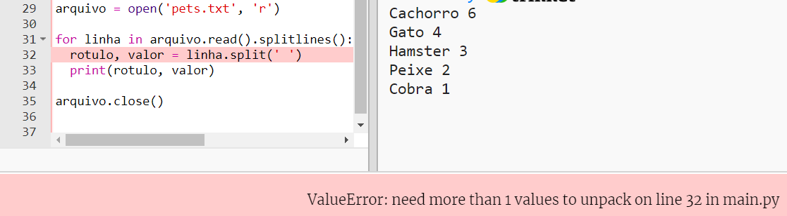

## Ler dados de um arquivo

É útil poder armazenar dados em um arquivo em vez de ter que incluí-los em seu código.

+ Adicione um novo arquivo ao seu projeto e chame-o de `pets.txt`:
    
    

+ Agora adicione dados ao arquivo. You can use the favourite pets data that you collected or the example data.
    
    

+ Volte para `main.py` e comente as linhas que renderizam (exibem) tabelas e gráficos (para que não sejam exibidos):
    
    

+ Agora vamos ler os dados do arquivo.
    
    
    
    The `for` loop will loop over the lines in the file. `splitlines ()` remove o caractere de nova linha do final da linha, já que você não quer isso.

+ Cada linha precisa ser separada em um rótulo e um valor:
    
    
    
    Isso dividirá a linha nos espaços, portanto, não inclua espaços nos rótulos. (Você pode adicionar suporte para espaços em rótulos depois.)

+ Você pode receber um erro como este:
    
    
    
    Isso acontece se você tiver uma linha vazia no final do seu arquivo.
    
    Você pode corrigir o erro obtendo o rótulo e o valor apenas se a linha não estiver vazia.
    
    To do this, indent the code inside your `for` loop and add the code `if line:` above it:
    
    

+ Você pode remover a linha `print(rotulo, valor)` agora que está tudo funcionando.

+ Agora vamos adicionar o rótulo e o valor a um novo gráfico de pizza e renderizá-lo:
    
    
    
    Note that `add` expects the value to be a number, `int(value)` turns the value from a string into an integer.
    
    If you wanted to use decimals such as 3.5 (floating point numbers) you could use `float(value)` instead.