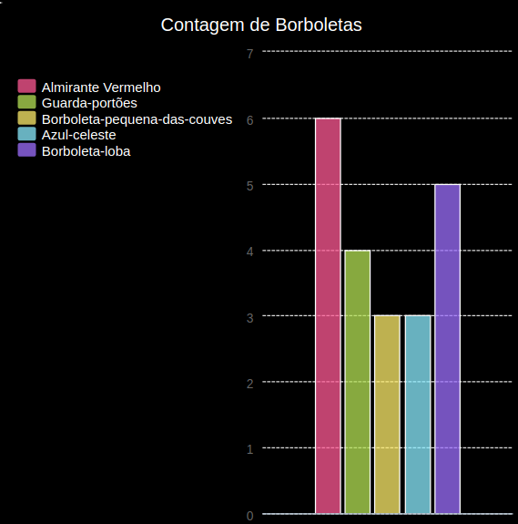

\--- desafio \---

## Desafio: crie um novo gráfico a partir de um arquivo

Você pode criar um novo gráfico de barras ou gráfico de pizza a partir de dados em um arquivo? Você precisará criar um novo arquivo .txt.

Dica: Se você quiser espaços nos rótulos, use `line.split (':')` e adicione dois pontos ao seu arquivo de dados, por exemplo, 'Red Admiral: 6'

\--- / desafio \---