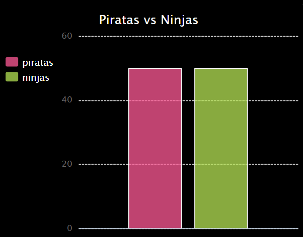

--- challenge ---

## Desafio: mais gráficos e tabelas!

Você consegue criar um gráfico de pizza e um gráfico de barras a partir do mesmo arquivo? Você pode usar os dados coletados anteriormente ou coletar novos dados.

--- /challenge ---

***
Tradução Contribuída pela Comunidade

Este projeto foi traduzido por Isabela Blucher e revisado por Flavio Silva.

Nossos incríveis voluntários de tradução nos ajudam a dar as crianças em todo o mundo a oportunidade de aprender a programar. Você pode nos ajudar a alcançar mais crianças traduzindo nossos projetos - leia mais em [rpf.io/translate](https://rpf.io/translate).