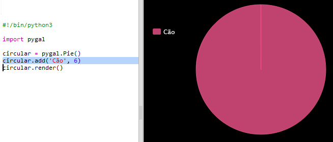
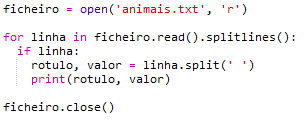
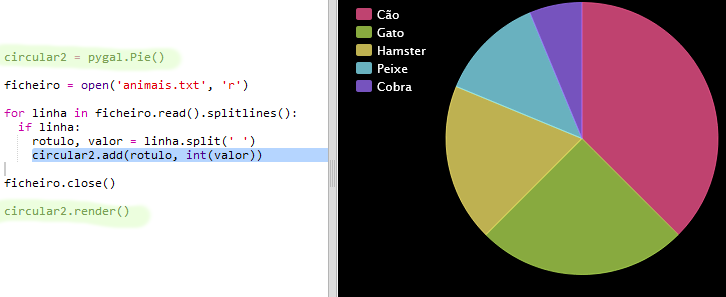

# Introdução {.intro}

Neste projeto, irás criar gráficos de pizza e gráficos de barra a partir de dados recolhidos entre os membros do teu Code Club.

  <iframe src="https://trinket.io/embed/python/70d24d92b8?outputOnly=true&start=result" width="600" height="500" frameborder="0" marginwidth="0" marginheight="0" allowfullscreen>
  </iframe>
  

# Etapa 1: criar um gráfico de pizza {.activity}

Os Gráficos de pizza são uma ferramenta útil de apresentar dados. Vamos fazer uma pesquisa sobre os animais favoritos no teu Code Club para depois apresentar os dados na forma de um gráfico de pizza.

## Lista de atividades {.check}

+ Pede a um voluntário para ajudar a organizar um inquérito. Podes gravar os resultados num computador ligado a um projetor ou quadro branco para que todos possam ver.
    
    Escreve uma lista de animais de estimação e certifica-te que todos os favoritos estão incluídos.
    
    Depois, faz com que todos votem no seu favorito levantando a mão quando disseres o seu nome. Cada membro do Clube apenas pode votar uma vez!
    
    Por exemplo:
    
    

+ Abra o modelo em branco do Python Trinket: <a href="http://jumpto.cc/python-new" target="_blank">jumpto.cc/python-new</a>.

+ Vamos criar um gráfico de pizza para mostrar os resultados do teu inquérito. Utiliza a biblioteca PyGal para fazer um pouco do trabalho mais pesado.
    
    Primeiro importa a biblioteca Pygal:
    
    

+ Agora vamos criar um gráfico de pizza e renderizar (exibir):
    
    
    
    Não te preocupes, fica mais interessante quando adicionas os dados!

+ Vamos adicionar os dados para um dos animais de estimação. Utiliza os dados que recolheste.
    
    
    
    Há apenas um dado, pelo que ocupa todo o gráfico de pizza.

+ Agora adiciona os restantes dados da mesma forma.
    
    Por exemplo:
    
    

+ E para finalizar, adiciona um título ao teu gráfico:
    
    

## Guarda o teu projeto {.save}

## Desafio: cria o teu próprio gráfico de barras {.challenge}

Podes criar gráficos de barras de forma semelhante. Basta utilizar `barchart = pygal.Bar ()` para criar um novo gráfico de barras, adicionar dados e renderizar da mesma forma que num gráfico de pizza.

Recolhe dados entre os membros do teu Code Club para criar o teu gráfico de barras.

Certifica-te que escolhes um tópico que todos conheçam!

Aqui estão algumas idéias:

+ Qual é a tua comida preferida?

+ Qual é o teu sabor favorito de gelado?

+ Como chegas à escola?

+ Qual é o mês do teu aniversário?

+ Tu jogas minecraft? (sim/não)

Não faça perguntas que forneçam dados pessoais, como o local em que as pessoas moram. Pergunta ao líder do teu clube se não tiveres a certeza.

Exemplos:

## Guarda o teu projeto {.save}

# Etapa 2: ler dados de um ficheiro {.activity}

É útil poder armazenar dados num ficheiro em vez de ter que os incluir no teu código.

## Lista de atividades {.check}

+ Adiciona um novo ficheiro ao teu projeto e chama-o `pets.txt`:
    
    

+ Agora adiciona dados ao ficheiro. Podes utilizar os dados sobre os animais de estimação favoritos recolhidos ou dados de exemplo.
    
    

+ Volta para `main.py` e comenta as linhas que renderizam (apresentam) quadros e gráficos (para que não sejam apresentados):
    
    

+ Agora vamos ler os dados do ficheiro.
    
    
    
    O ciclo `for` irá ler as linhas no ficheiro. `splitlines()` remove o character de nova linha (newline) do final da linha, visto não ser o pretendido.

+ Cada linha deve ser separada num rótulo e valor:
    
    
    
    Isto irá dividir a linha nos espaços, por isso, não incluas espaços nos nomes dos rótulos. (Podes acrescentar suporte para espaços em rótulos posteriormente.)

+ Podes receber um erro como este:
    
    
    
    Isto acontece se tiveres uma linha vazia no final do teu ficheiro.
    
    Pode corrigir o erro obtendo apenas o rótulo e o valor se a linha não estiver vazia.
    
    Para fazer isso, indenta o código dentro do teu ciclo `for` e adiciona o código `if line:` acima:
    
    

+ Podes remover a linha `print (label, value)` e agora deve estar tudo a funcionar.

+ Agora vamos adicionar o rótulo e o valor a um novo gráfico de pizza e renderizá-lo:
    
    
    
    Nota que `add` espera que o valor seja um número, `int (value)` transforma o valor de uma sequência de caracteres num número inteiro.
    
    Se quisesses utilizar números decimais como 3.5 (números de virgula flutuante), poderias utilizar `float (valor)`.

## Guarda o teu projeto {.save}

## Desafio: cria um novo gráfico a partir de um ficheiro {.challenge}

Podes criar um novo gráfico de barras ou gráfico de pizza a partir de dados num ficheiro? Vais necessitar de criar um novo ficheiro .txt.

Dica: Se quiseres ter espaços nos rótulos, usa `line.split (':')` e adiciona dois pontos ao teu arquivo de dados, por exemplo, 'Red Admiral: 6'

## Salva o teu projeto {.save}

## Desafio: Mais gráficos e tabelas! {.challenge}

Consegues criar um gráfico de pizza e um gráfico de barras do mesmo arquivo? Podes utilizar os dados recolhidos anteriormente ou recolher novos dados.

## Salva o teu projeto {.save}