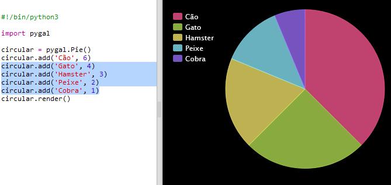

## Create a Pie Chart

Pie Charts are useful way of showing data. Let's do a survey of favourite pets in your Code Club and then present the data as a Pie Chart.

+ Pede ao líder do teu clube para ajudar a organizar a pesquisa. Podes gravar os resultados num computador ligado a um projetor ou quadro branco que todos possam ver.
    
    Escreve uma lista de animais de estimação e certifica-te que todos os animais favoritos estão incluídos.
    
    Então pede a todos que votem no seu animal favorito, pondo a mão no ar quando o seu for referido. Apenas um voto cada!
    
    Por exemplo:
    
    

+ Abre o modelo em branco do Python Trinket: <a href="http://jumpto.cc/python-new" target="_blank">jumpto.cc/python-new</a>.

+ Let's create a pie chart to show the results of your survey. Vais estar a utilizar a biblioteca PyGal para fazer um pouco do trabalho pesado.
    
    Primeiro importa a biblioteca Pygal:
    
    

+ Now let's create a Pie chart and render (display) it:
    
    
    
    Não te preocupes, vai ficar mais interessante quando acrescentares dados!

+ Vamos acrescentar os dados de um dos animais de estimação. Utiliza os dados que recolheste.
    
    
    
    Como há apenas dados de um animal, ele ocupa todo o espaço do gráfico.

+ Agora adiciona os restantes dados da mesma maneira.
    
    For example:
    
    

+ E para finalizar o teu gráfico, adiciona-lhe um título:
    
    