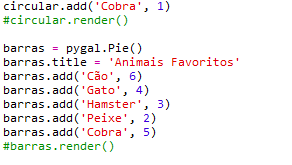
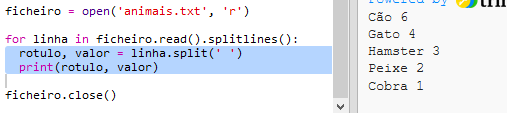

## Ler dados de um ficheiro

É útil poder armazenar dados num ficheiro em vez de ter que os incluir no teu código.

+ Adiciona um novo ficheiro ao teu projeto e chama-o `animais.txt`:
    
    

+ Agora adiciona dados ao ficheiro. Agora podes usar os dados sobre os animais de estimação favoritos recolhidos ou dados de exemplo.
    
    

+ Volta para `main.py` e comenta as linhas que renderizam (apresentam) quadros e gráficos (para que não sejam apresentados):
    
    

+ Agora vamos ler os dados do ficheiro.
    
    
    
    O ciclo`for` fará vários ciclos pelas linhas no ficheiro. `splitlines ()` remove o caractere de nova linha do final da linha, pois tu não queres isso.

+ Cada linha precisa de ser separada num rótulo e valor:
    
    
    
    Isso dividirá a linha nos espaços, portanto, não incluas espaços nos rótulos. (Podes adicionar suporte para espaços em rótulos posteriormente.)

+ Podes receber um erro como este:
    
    
    
    Isto acontece se tiveres uma linha vazia no final do teu ficheiro.
    
    Podes corrigir o erro obtendo apenas o rótulo e o valor se a linha não estiver vazia.
    
    Para fazer isso, indenta o código dentro do teu ciclo `dor` e adiciona o código `if linha:` acima:
    
    

+ Podes remover a linha `print (rotulo, valor)` e agora deve estar tudo a funcionar.

+ Agora vamos adicionar o rótulo e o valor a um novo gráfico circular e renderizá-lo:
    
    
    
    Note que `add` espera que o valor seja um número, `int (valor)` transforma o valor de uma string em um inteiro.
    
    Se quisesses usar decimais como 3,5 (números de virgula flutuante) poderias usar `float (valor)`.