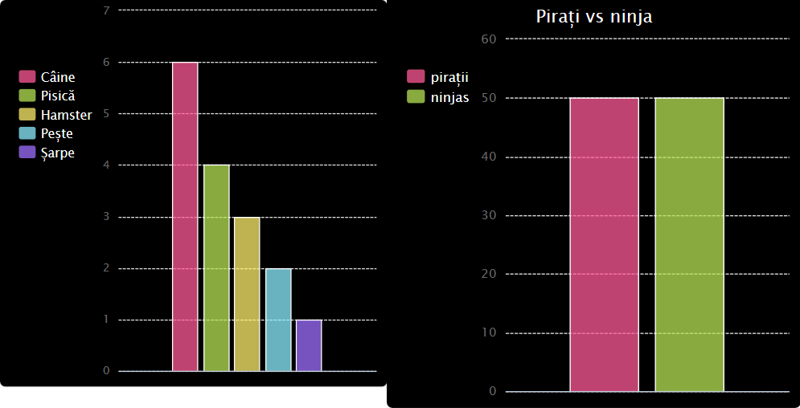
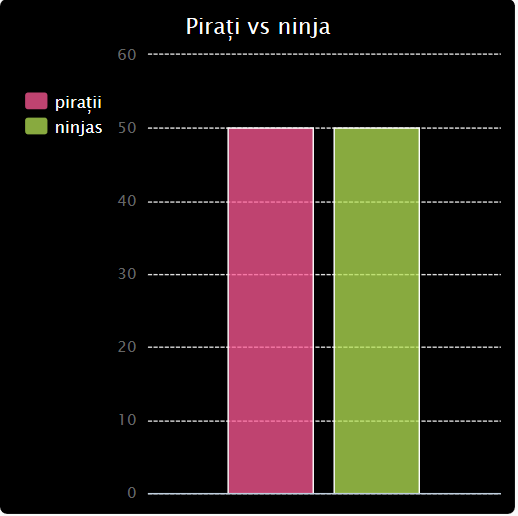

# Introducere {.intro}

În acest proiect creezi diagrame circulare și grafice cu bare din datele pe care le colectezi de la membrii Code Club din care faci parte.

  <iframe src="https://trinket.io/embed/python/70d24d92b8?outputOnly=true&start=result" width="600" height="500" frameborder="0" marginwidth="0" marginheight="0" allowfullscreen>
  </iframe>
  

# Pasul 1: Creează o diagramă circulară {.activity}

Diagramele circulare sunt un mod util de a afișa datele. Haide să facem un sondaj asupra animalelor de companie preferate în Code Club-ul din care faci parte și apoi să prezentăm datele sub forma unei diagrame circulare.

## Lista de verificare a activităților {.check}

+ Roagă-l pe voluntarul tău să te ajute să organizezi un sondaj. Poți înregistra rezultatele pe un computer conectat la un proiector sau pe o tablă albă pe care toată lumea o poate vedea.
    
    Scrie o listă cu animale de companie și asigură-te că sunt incluse animalele preferate ale tuturor.
    
    Apoi, citește lista de animale și pune pe toată lumea să își voteze favoritul, ridicând mâna atunci când aude denumirea animalului de companie favorit. Fiecare poate vota o singură dată!
    
    De exemplu:
    
    

+ Deschide un șablon Python Trinket: <a href="http://jumpto.cc/python-new" target="_blank">jumpto.cc/python-new</a>.

+ Creează o diagramă circulară care să afișeze rezultatele sondajului tău. Vei folosi biblioteca PyGal pentru a face o parte din munca grea.
    
    Mai întâi importă biblioteca Pygal:
    
    

+ Acum, să creăm o diagramă circulară și să o redăm (afișăm):
    
    
    
    Nu iți face griji, devine mai interesant atunci când o să adaugi date!

+ Să adăugăm datele pentru unul dintre animalele de companie. Folosește datele pe care le-ai colectat.
    
    
    
    Există un singur animal de companie, prin urmare, acesta acoperă întreaga diagramă circulară.

+ Acum adaugă restul de date în același mod.
    
    De exemplu:
    
    

+ Pentru a termina diagrama circulară, adaugă un titlu (title):
    
    

## Salvează proiectul {.save}

## Provocare: Creează-ți propriul grafic cu bare {.challenge}

Poți crea un grafic cu bare într-un mod similar. Utilizează doar `grafic_bare = pygal.Bar()` pentru a crea un grafic cu bare nou, apoi adăugă date și redă-l în același mod ca o diagramă cu bare.

Colectează date de la membrii Code Club-ului tău pentru ați crea propriul grafic cu bare.

Asigură-te că alegi un subiect pe care toată lumea îl cunoaște!

Iată câteva idei:

+ Care este sportul favorit?

+ Care este aroma de înghețată preferată?

+ Cum ajungi la școală?

+ În ce lună este ziua ta de naștere?

+ Joci Minecraft? (da/nu)

Nu pune întrebări care oferă date personale, cum ar fi locul în care locuiesc oamenii. Întreabă-ți liderul clubului dacă nu ești sigur.

Exemple:

## Salvează proiectul {.save}

# Pasul 2: Citiți datele dintr-un fișier {.activity}

Este mai util să stochezi datele într-un fișier, decât să le incluzi direct în codul tău.

## Lista de verificare a activităților {.check}

+ Adaugă un nou fișier la proiect și denumește-l `pets.txt`:
    
    

+ Acum adaugă date în fișier. Poți utiliza datele animalelor de companie preferate pe care le-ai colectat sau datele din exemplu.
    
    

+ Mergi înapoi la fișierul `main.py` și comentează liniile care redau (afișează) diagramele și graficele (astfel încât acestea să nu fie afișate):
    
    

+ Acum să citim datele din fișier.
    
    
    
    Bucla `for` va parcurge fiecare linie din fișier. Funcția `splitlines()` elimină caracterul de linie nouă de la sfârșitul liniei, deoarece nu avem nevoie de acel caracter.

+ Fiecare linie trebuie să fie separată într-o etichetă și o valoare:
    
    
    
    Acest cod separă cuvintele unei linii la întâlnirea caracterului spațiu, prin urmare nu utiliza spații când scrii denumirile etichetelor din fișier. (Vei vedea ulterior cum poți adăuga spații în etichete.)

+ Este posibil să primești o eroare de acest fel:
    
    
    
    Acest lucru se întâmplă dacă ai o linie goală la sfârșitul fișierului.
    
    Poți remedia eroarea obținând eticheta și valoarea numai dacă linia nu este goală.
    
    Pentru a face acest lucru, indentează codul aflat în interiorul buclei `for` și adaugă linia de cod `if line:` deasupra acestuia:
    
    

+ Poți elimina linia `print(label, value)`, iar acum totul funcționează.

+ Acum, adaugă eticheta și valoarea într-o nouă diagramă circulară și redă-o:
    
    
    
    Reține că `add` se așteaptă ca valoarea să fie un număr, `int(value)` transformă valoarea dintr-un șir de caractere într-un număr întreg.
    
    Dacă dorești să utilizezi numere zecimale, cum ar fi 3.5 (numere în virgula flotantă), poți utiliza `float(value)`.

## Salvează proiectul {.save}

## Provocare: Creează o diagramă nouă dintr-un fișier {.challenge}

Poți crea un nou grafic de bare sau o nouă diagramă circulară din datele aflate într-un fișier? Va trebui să creezi un nou fișier .txt.

Sfat: Dacă dorești să ai spații în etichete, utilizează `line.split(':')` și adaugă caracterul „:” în locul spațiilor în fișierul tău de date, de exemplu 'Amiral Roșu: 6'

## Salvează proiectul {.save}

## Provocare: Mai multe diagrame și grafice! {.challenge}

Poți crea o diagramă circulară și un grafic de bare din același fișier? Poți utiliza datele pe care le-ai colectat anterior sau poți colecta date noi.

## Salvează proiectul {.save}