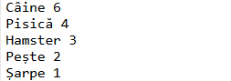
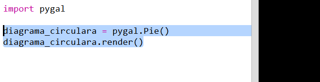
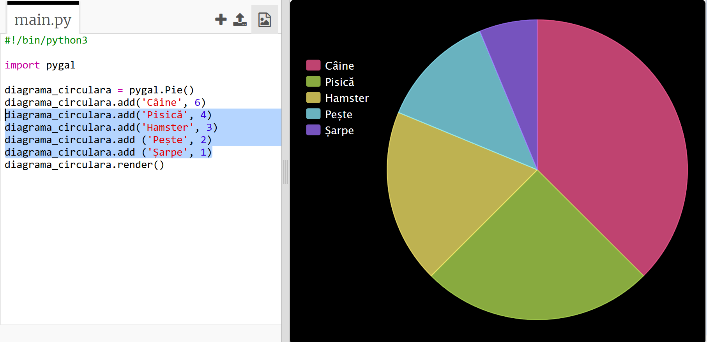

## Creează o diagramă circulară

Pie Charts are useful way of showing data. Haide să facem un sondaj asupra animalelor de companie preferate în Code Club-ul din care faci parte și apoi să prezentăm datele sub forma unei diagrame circulare.

+ Cere-i conducătorului clubului tău să te ajute să organizezi un sondaj. Poți înregistra rezultatele pe un computer conectat la un proiector sau pe o tablă albă pe care toată lumea o poate vedea.
    
    Scrie o listă cu animale de companie și asigură-te că sunt incluse animalele preferate ale tuturor.
    
    Apoi, citește lista de animale și pune pe toată lumea să își voteze favoritul, ridicând mâna atunci când aude denumirea animalului de companie favorit. Fiecare poate vota o singură dată!
    
    De exemplu:
    
    

+ Deschide un șablon Python Trinket: <a href="http://jumpto.cc/python-new" target="_blank">jumpto.cc/python-new</a>.

+ Creează o diagramă circulară care să afișeze rezultatele sondajului tău. Vei folosi biblioteca PyGal pentru a face o parte din munca grea.
    
    Mai întâi importă biblioteca Pygal:
    
    

+ Acum, să creăm o diagramă circulară și să o redăm (afișăm):
    
    
    
    Nu iți face griji, devine mai interesant atunci când o să adaugi date!

+ Să adăugăm datele pentru unul dintre animalele de companie. Folosește datele pe care le-ai colectat.
    
    
    
    Există un singur animal de companie, prin urmare, acesta acoperă întreaga diagramă circulară.

+ Acum adaugă restul de date în același mod.
    
    De exemplu:
    
    

+ Pentru a termina diagrama circulară, adaugă un titlu (title):
    
    