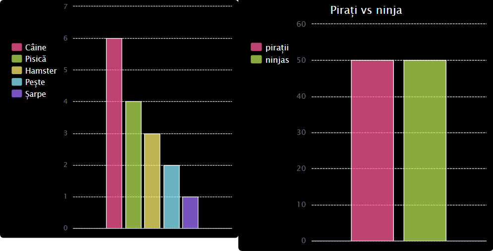

\--- challenge \---

## Provocare: Creează-ți propriul grafic cu bare

Poți crea un grafic cu bare într-un mod similar. Poți crea un grafic cu bare într-un mod similar. Utilizează doar `grafic_bare = pygal.Bar()` pentru a crea un grafic cu bare nou, apoi adăugă date și redă-l în același mod ca o diagramă cu bare.

Colectează date de la membrii Code Club-ului tău pentru a-ți crea propriul grafic cu bare.

Asigură-te că alegi un subiect pe care toată lumea îl cunoaște!

Iată câteva idei:

+ Care este sportul favorit?
+ Care este aroma de înghețată preferată?
+ Cum ajungi la școală?
+ În ce lună este ziua ta de naștere?
+ Joci Minecraft? (da/nu)

Nu pune întrebări care oferă date personale, cum ar fi locul în care locuiesc oamenii. Întreabă-ți liderul clubului dacă nu ești sigur.

Exemple:

\--- /challenge \---