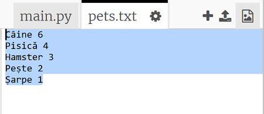
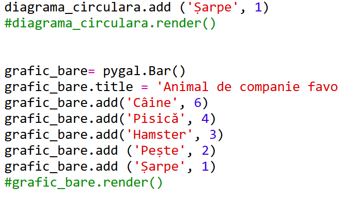
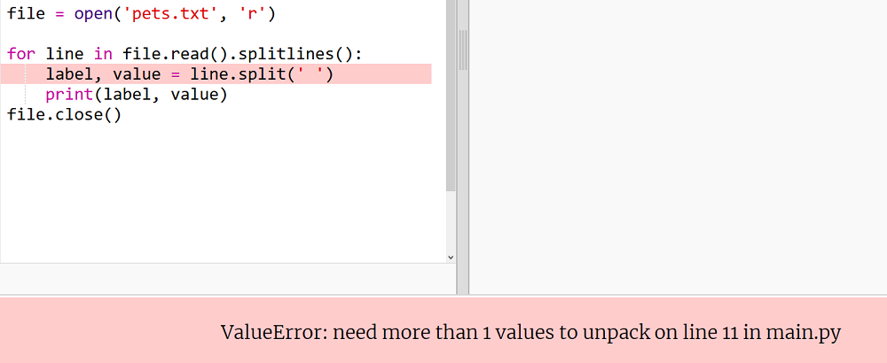

## Citește datele dintr-un fișier

Este mai util să stochezi datele într-un fișier, decât să le incluzi direct în codul tău.

+ Adaugă un nou fișier la proiect și denumește-l `pets.txt`:
    
    

+ Acum adaugă date în fișier. Poți utiliza datele animalelor de companie preferate pe care le-ai colectat sau datele din exemplu.
    
    

+ Mergi înapoi la fișierul `main.py` și comentează liniile care redau (afișează) diagramele și graficele (astfel încât acestea să nu fie afișate):
    
    

+ Acum să citim datele din fișier.
    
    
    
    Bucla `for` va parcurge fiecare linie din fișier. Funcția `splitlines()` elimină caracterul de linie nouă de la sfârșitul liniei, deoarece nu avem nevoie de acel caracter.

+ Fiecare linie trebuie să fie separată într-o etichetă și o valoare:
    
    
    
    Acest cod separă cuvintele unei linii la întâlnirea caracterului spațiu, prin urmare nu utiliza spații când scrii denumirile etichetelor din fișier. (Vei vedea ulterior cum poți adăuga spații în etichete.)

+ Este posibil să primești o eroare de acest fel:
    
    
    
    Acest lucru se întâmplă dacă ai o linie goală la sfârșitul fișierului.
    
    Poți remedia eroarea obținând eticheta și valoarea numai dacă linia nu este goală.
    
    Pentru a face acest lucru, indentează codul aflat în interiorul buclei `for` și adaugă linia de cod `if line:` deasupra acestuia:
    
    

+ Poți elimina linia `print(label, value)`, iar acum totul funcționează.

+ Acum, adaugă eticheta și valoarea într-o nouă diagramă circulară și redă-o:
    
    
    
    Reține că `add` se așteaptă ca valoarea să fie un număr, `int(value)` transformă valoarea dintr-un șir de caractere într-un număr întreg.
    
    Dacă dorești să utilizezi numere zecimale, cum ar fi 3.5 (numere în virgula flotantă), poți utiliza `float(value)`.