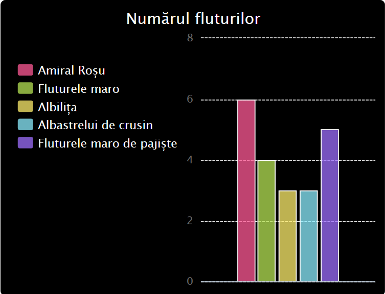

--- challenge ---

## Provocare: Creează o diagramă nouă dintr-un fișier

Poți crea un nou grafic de bare sau o nouă diagramă circulară din datele aflate într-un fișier? Va trebui să creați un nou fișier .txt.

Sfat: Dacă dorești să ai spații în etichete, utilizează `line.split(':')` și adaugă caracterul „:” în locul spațiilor în fișierul tău de date, de exemplu 'Amiral Roșu: 6'

--- /challenge ---