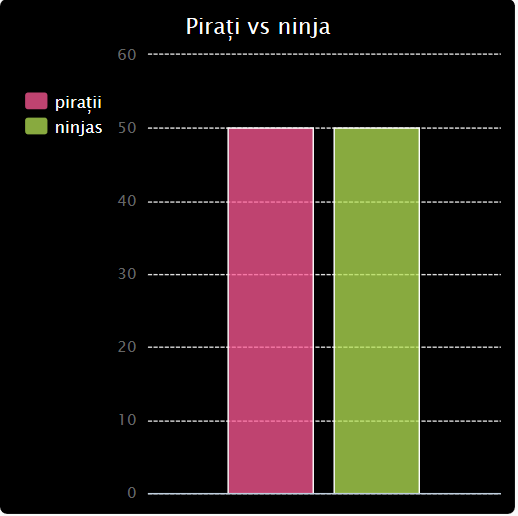
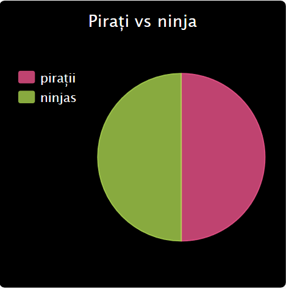

--- challenge ---

## Provocare: Mai multe diagrame și grafice!

Poți crea o diagramă circulară și un grafic de bare din același fișier? Poți utiliza datele pe care le-ai colectat anterior sau poți colecta date noi.

--- /challenge ---

***
Acest proiect a fost tradus de voluntarii:

**Liviu Celcan**

**Cristian Iacob**

Datorită voluntarilor, putem oferi oamenilor din întreaga lume șansa de a învăța în propria lor limbă. Ne poți ajuta să ajungem la mai multe persoane, ajutând la traducere ca și voluntar - mai multe informații la [rpf.io/translate](https://rpf.io/translate).