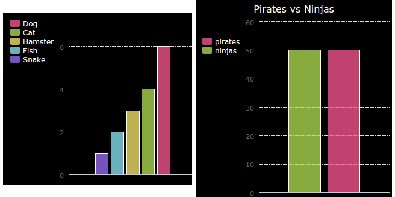

# Giriş {.intro}

Bu projede, Kod Kulübünüzün üyelerinden topladığınız verilerden pasta grafikler ve çubuk grafikler oluşturacaksınız.

  <iframe src="https://trinket.io/embed/python/70d24d92b8?outputOnly=true&start=result" width="600" height="500" frameborder="0" marginwidth="0" marginheight="0" allowfullscreen>
  </iframe>
  

# Step 1: Create a Pie Chart {.activity}

Pasta Grafikler, verileri göstermenin kullanışlı bir yoludur. Kod Kulübünüzde en sevdiğiniz evcil hayvanlar hakkında bir anket yapalım ve ardından verileri Pasta Grafiği olarak sunalım.

## Etkinlik Kontrol Listesi {.check}

+ Gönüllünüzden bir anket düzenlemesine yardımcı olmasını isteyin. Sonuçları, herkesin görebileceği bir projektöre bağlı bilgisayara veya beyaz tahtaya kaydedebilirsiniz.
    
    Bir evcil hayvan listesi yazın ve herkesin favorisinin dahil edildiğinden emin olun.
    
    Ardından herkesin favorisi seslenildiğinde elini yukarı kaldırarak oy vermesini sağlayın. Her bir seçenek için sadece bir oy!
    
    Örneğin:
    
    

+ Trinket'ta boş Python şablonunu açın: <a href="http://jumpto.cc/python-new" target="_blank">jumpto.cc/python-new</a>.

+ Anketinizin sonuçlarını göstermek için bir pasta grafiği oluşturalım. Zor işleri yapması için PyGal kütüphanesini kullanacaksınız.
    
    İlk önce Pygal kütüphanesini içe aktarın:
    
    

+ Şimdi bir Pasta grafiği oluşturalım ve ekrana yansıtalım (görüntüleyelim):
    
    
    
    Endişelenmeyin, veri eklediğinizde daha ilginç hale gelecektir!

+ Evcil hayvanlardan birinin verilerini ekleyelim. Topladığınız verileri kullanın.
    
    
    
    Sadece bir veri parçası var, bu yüzden bütün pasta grafiğini kaplıyor.

+ Şimdi diğer verileri de aynı şekilde ekleyin.
    
    Örneğin:
    
    

+ En sonunda grafiğinizi bitirmek için bir başlık ekleyin:
    
    

## Projenizi Kaydedin {.save}

## Meydan okuma: Kendi çubuk grafiğinizi oluşturun {.challenge}

Benzer şekilde çubuk grafikler de oluşturabilirsiniz. Yeni bir çubuk grafiği oluşturmak için `cubukgrafik = pygal.Bar ()` kodunu kullanın, ardından verileri ekleyin ve pasta grafiğiyle aynı şekilde ekranda görüntüleyin.

Kendi çubuk grafiğinizi oluşturmak için Kod Kulübü üyelerinizden veri toplayın.

Herkesin bileceği bir konu seçtiğinizden emin olun!

Birkaç tane fikir:

+ En sevdiğin spor ne?

+ En sevdiğin dondurma aroması nedir?

+ Okula nasıl gidiyorsun?

+ Hangi ayda doğdun?

+ Minecraft oynuyor musun? (Evet Hayır)

İnsanların nerede yaşadıkları gibi kişisel veriler içeren sorular sormayın. Emin değilseniz kulüp liderinize sorun.

Örnekler:

## Projenizi Kaydedin {.save}

# 2. Adım: Bir dosyadan veri okuma {.activity}

Kodunuza dahil etmek yerine verileri bir dosyada depolamak daha kullanışlıdır.

## Etkinlik Kontrol Listesi {.check}

+ Projenize yeni bir dosya ekleyin ve dosyaya `evciller.txt` adını verin:
    
    

+ Şimdi dosyaya veriyi ekleyin. Topladığınız favori evcil hayvan verilerini veya örnek verileri kullanabilirsiniz.
    
    

+ Switch back to `main.py` and comment out the lines that render (display) charts and graphs (so that they aren't displayed):
    
    

+ Now let's read the data from the file.
    
    
    
    The `for` loop will loop over the lines in the file. `splitlines()` removes the newline character from the end of the line as you don't want that.

+ Each line needs to be separated into a label and a value:
    
    
    
    This will split the line at the spaces so don't include spaces in the labels. (You can add support for spaces in labels later.)

+ You might get an error like this:
    
    
    
    This happens if you have an empty line at the end of your file.
    
    You can fix the error by only getting the label and value if the line isn't empty.
    
    To do this, indent the code inside your `for` loop and add the code `if line:` above it:
    
    

+ You can remove the `print(label, value)` line now everything is working.

+ Now let's add the label and value to a new Pie Chart and render it:
    
    
    
    Note that `add` expects the value to be a number, `int(value)` turns the value from a string into an integer.
    
    If you wanted to use decimals such as 3.5 (floating point numbers) you could use `float(value)` instead.

## Save Your Project {.save}

## Challenge: Create a new chart from a file {.challenge}

Can you create a new bar graph or pie chart from data in a file? You'll need to create a new .txt file.

Tip: If you want to have spaces in the labels then use `line.split(': ')` and add colons to your data file, e.g. 'Red Admiral: 6'

## Save Your Project {.save}

## Challenge: More charts and graphs! {.challenge}

Can you create a pie chart and a bar chart from the same file? You can either use the data you collected earlier or collect some new data.

## Save Your Project {.save}