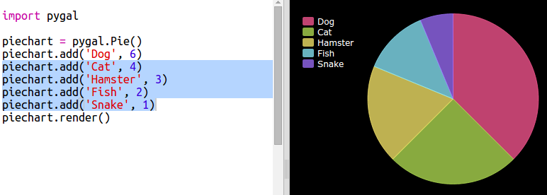

## Створення кругової діаграми

Кругові діаграми - це корисний спосіб показати дані. Давайте проведемо опитування улюблених домашніх тварин у Вашому Кодексі Клубу, а потім надамо дані у вигляді кругової діаграми.

+ Запитайте свого лідера клубу, щоб допомогти організувати опитування. Ви можете записувати результати на комп'ютері, підключеному до проектора або дошки, яку кожен може бачити.
    
    Напишіть список домашніх тварин і переконайтеся, що всі улюблені включені.
    
    Тоді всі повинні проголосувати за свого улюбленця, поклавши руку вгору, коли його викличе. Тільки один голос кожного!
    
    Наприклад:
    
    

+ Відкрийте пустий шаблон Python Брелок: <a href="http://jumpto.cc/python-new" target="_blank">jumpto.cc/python-new</a>.

+ Створімо кругова діаграма, щоб показати результати вашого опитування. Ви будете використовувати бібліотеку PyGal, щоб виконати якусь важку роботу.
    
    Спочатку імпортуйте бібліотеку Pygal:
    
    

+ Тепер створімо кругову діаграму та візуалізуємо (відображення) її:
    
    
    
    Не хвилюйтеся, коли ви додасте дані, це стає цікавіше!

+ Додамо дані для одного з домашніх тварин. Використовуйте дані, які ви зібрали.
    
    
    
    Є лише одна частина даних, тому вона займає всю діаграму.

+ Тепер додайте решту даних таким же чином.
    
    Наприклад:
    
    

+ Щоб завершити свій графік, додайте заголовок:
    
    