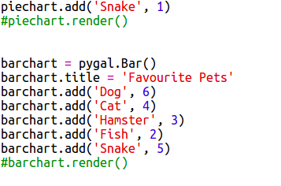

## Читати дані з файлу

Це корисно мати можливість зберігати дані у файлі, а не додавати його до коду.

+ Додайте новий файл у ваш проект і назвіть його `pets.txt`:
    
    

+ Тепер додайте дані до файлу. Ви можете використовувати зібрані вами улюблені домашні тварини або приклади даних.
    
    

+ Поверніться назад до `main.py` і коментувати рядки, які відтворюють діаграми та графіки (так, щоб вони не відображалися):
    
    

+ Тепер давайте читаємо дані з файлу.
    
    
    
    `для циклу` буде петля над рядками у файлі. `splitlines ()` видаляє символ нової рядка з кінця рядка, оскільки ви цього не бажаєте.

+ Кожен рядок потрібно розділити на мітку та значення:
    
    
    
    Це розділить рядок на пробіли, тому не включайте пробіли в мітки. (Пізніше ви можете додати підтримку пробілів у етикетках.)

+ Ви можете отримати таку помилку:
    
    
    
    Це трапляється, якщо в кінці файлу є порожня рядок.
    
    Ви можете виправити помилку, тільки отримавши мітку та значення, якщо рядок не порожній.
    
    Для цього вставте код усередині вашої `для циклу` і додайте код `, якщо рядок:` над ним:
    
    

+ Ви можете вилучити `друк (мітка, значення)` , тепер все працює.

+ Тепер давайте додамо мітку та значення до нової кругової діаграми та зробимо її:
    
    
    
    Зауважте, що `додати` очікує, що значення буде числом, `int (value)` перетворює значення з рядка у ціле число.
    
    Якщо ви хочете використовувати десяткові знаки, такі як 3.5 (номери з плаваючою точкою), ви можете використовувати `float (значення)`.