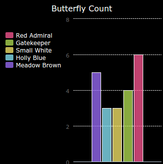

\--- завдання \---

## Виклик: створити нову діаграму з файлу

Чи можете ви створити нову гістограму або діаграму з даних у файлі? Вам потрібно буде створити новий файл .txt.

Порада: якщо ви хочете мати пробіли на етикетках, скористайтеся `line.split (':')` і додайте двокрапки у ваш файл даних, наприклад "Red Admiral: 6"

\--- / виклик \---