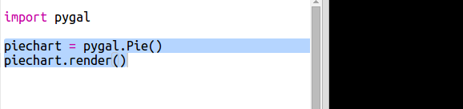

## 创建一个饼图

饼图是显示数据的一种有效方式。让我们在你的 Code Club 中进行一项最喜爱宠物的调查，然后将相关数据以饼图显示出来。

+ 请你的志愿者帮忙组织一场调查。你可以将调查结果记录在连接投影仪的电脑上或大家都可以看到的白板上。

  列出一份宠物清单，并确保包含每个人最喜爱的宠物。

  然后请每个人在念到自己最爱的宠物时举手，以此来进行投票。每个人只能投一票！

  例如：

  

+ 打开空白 Python 模版 Trinket：<a href="http://jumpto.cc/python-new" target="_blank">jumpto.cc/python-new</a>。

+ 让我们创建一个饼图来显示你的调查结果。你将使用 PyGal 库来进行一些困难的工作。

  首先导入 Pygal 库：

  

+ 现在让我们创建一张饼图并将其呈现（显示）出来：

  

  不要担心，你添加数据之后会变得更加有趣！

+ 让我们来添加其中一种宠物的数据。运用你所收集的数据。

  

  因为只有一条数据，所以它占据了整张饼图。

+ 现在以同样的方式添加其他数据。

  例如：

  

+ 为完成你的图表，请添加一个标题：

  

