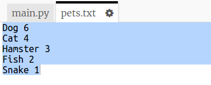
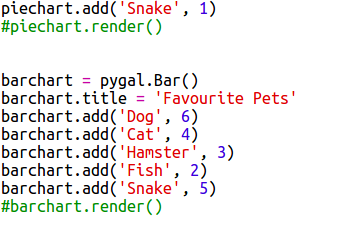

## 从文件读取数据

能够在文件中储存数据而不是必须将数据添加到你的代码中，这一点非常有用。

+ 向你的项目添加一个新文件并命名为 `pets.txt`：

  

+ 现在向该文件添加数据。你可以使用你收集的最喜爱宠物的数据或者示例数据。

  

+ 切换回 `main.py` 并注释掉呈现（显示）图表和图形的相关行（使其不被显示出来）：

  

+ 现在让我们从文件中读取数据。

  

  `for` 循环将循环遍历文件中的多行内容。`splitlines()` 将换行符从行末移除，因为你不需要它。

+ 每行需要被分成一个标签和一个值：

  

  将以空格来分行，因此请不要在标签中加入空格。（你可以随后在标签中添加对空格的支持。）

+ 你可能会遇到如下所示的错误：

  

  如果你的文件末尾存在空行，就会出现这种情况。

  如果该行不是空行，你只需通过获取标签和值来修复这个错误。

  为此，在你的 `for` 循环内部缩进相关代码并在其上方添加 `if line:` 代码：

  

+ 现在你可以将 `print(label, value)` 行移除，一切正常。

+ 现在让我们来向新的饼图添加标签和值，并将其显示出来：

  

  请注意 `add` 预期的值应为一个数字，`int(value)` 将值从字符串转换为整数。

  如果你想使用 3.5 之类的小数（浮点数），你可以使用 `float(value)` 代替。

